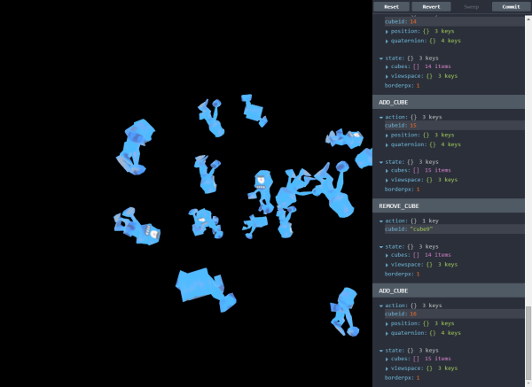

r3test
======

Demo/example of an app using react-three. Also uses [redux](https://github.com/rackt/redux)
along with its devtools for hot reload and history editing.



## Running the example

Checkout this repo from git, then

```
npm install
npm run dev
```

And point your browser at `localhost:8081`

